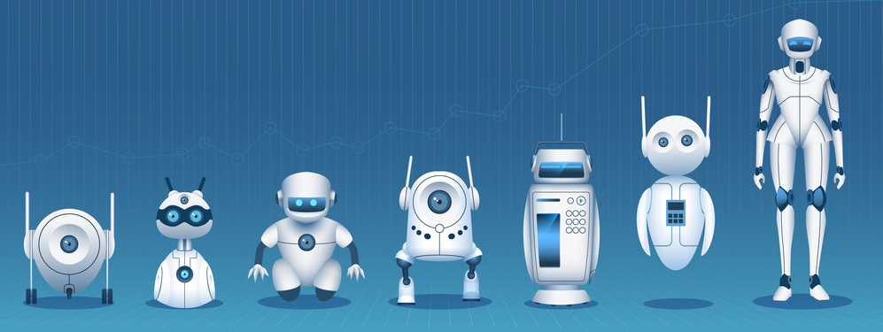

 

### robot-jetboy

**Quick-guide**

- clone this repo `git clone git@github.com:iteam1/robot-jetboy.git`

- go to [init](/init) then follow the instruction for setup in this folder.

- [gpio.py](/gpio.py): control robot gpio

- [server.py](/server.py): build a local webserver for manually control

- [gui.py](/gui.py): create a robot's face for visual-communication

if you want to run multi programs in the terminal:

	python3 gpio.py & server.py 

*Notes:*

- `jetson.GPIO`: This libary is built-in jetson-nano board or rasberry pi board, and just can run on this hardware

- `pyrealsense2`: build from source C with Cmake by bash-script

- `opencv-contrib-python`: build from source C with C make by bash-script but now it not necessary.

**Tools**

|No|tool|descript|
|---|---|---|
|1|[sublime-text](https://www.sublimetext.com/)|code editor|
|2|[diagrameditor](https://www.diagrameditor.com/)|drawing UML|
|3|[pixlr](https://pixlr.com/vn/x/)|design banner|
|4|[github](https://github.com/)|cloud platform for manage your project|
|5|[git](https://git-scm.com/)|control your repository|
|6|[ezgif](https://ezgif.com/maker)|ezgif maker|
|7|[symbolcopy](https://www.symbolcopy.com/)|get symbol character|
|8|[shields](https://shields.io/)|create your own git badges|
|9|[kleki](https://kleki.com/)|drawing sketch online|
    

**References**

[jetson-inference](https://github.com/dusty-nv/jetson-inference)

[installLibrealsense](https://github.com/JetsonHacksNano/installLibrealsense)